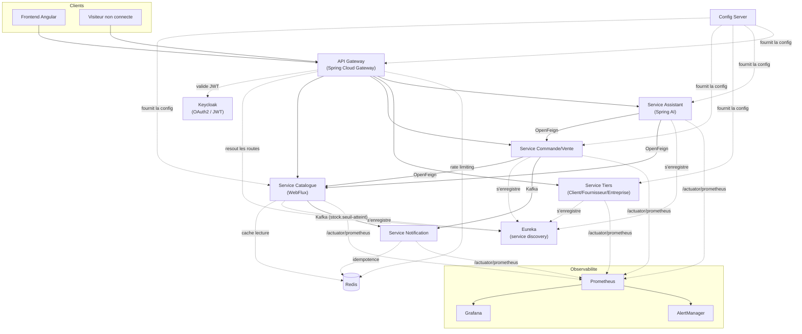

# Architecture technique

Ce document couvre les décisions techniques qui ne se modélisent pas dans un MCD (voir [`README.md`](./README.md) pour le modèle de données). Il sert de référence pour l'implémentation du `backend/`.

## Vue d'ensemble

Domaines métier (inchangés) :

- **Service Catalogue** : `Article`, `Categorie`, `MvtStk`.
- **Service Commande/Vente** : `CommandeClient`, `CommandeFournisseur`, `LigneCdeClt`, `LigneCdeFournisseur`, `Vente`, `LigneVente`.
- **Service Tiers** : `Client`, `Fournisseur`, `Entreprise`, `Utilisateur`.
- **Service Notification** : `EmailTemplate`, `Notification`.
- **Service Assistant** (nouveau, voir plus bas) : répond aux questions clients via Spring AI, ne possède pas ses propres entités métier — il consulte les autres services.

Nouvelles briques d'infrastructure couvertes dans ce document : **API Gateway**, **Eureka**, **Config Server**, **Prometheus/Grafana/AlertManager**, **Docker Compose**, **Spring AI**.

## Découverte de services (Eureka)

- Chaque microservice s'enregistre auprès d'**Eureka** au démarrage (`spring-cloud-starter-netflix-eureka-client`) sous un nom logique (`catalogue-service`, `commande-service`, `tiers-service`, `notification-service`, `assistant-service`).
- Les clients **OpenFeign** référencent les services par ce nom logique plutôt que par une URL en dur : `@FeignClient(name = "catalogue-service")`. Le load-balancing entre instances est géré automatiquement par Spring Cloud LoadBalancer — pas besoin de connaître l'IP/port de chaque instance.
- Le **Gateway** utilise aussi Eureka pour résoudre ses routes dynamiquement (`lb://catalogue-service`) : ajouter une instance ou un nouveau service ne demande pas de redéployer le Gateway.
- Une seule instance Eureka suffit pour démarrer (dev / petite prod). Passer en cluster peer-to-peer seulement si la haute disponibilité du registre devient un vrai besoin — ne pas le faire par anticipation.
- Eureka ne se contente pas de savoir qu'une instance existe : il doit aussi savoir si elle est **réellement en bonne santé** (voir section Actuator ci-dessous) avant de la proposer au load balancing — sinon le Gateway ou un client Feign peut router vers une instance démarrée mais non fonctionnelle (ex. connexion base de données perdue).

## Santé des services (Spring Boot Actuator)

Chaque microservice embarque **`spring-boot-starter-actuator`**, indispensable dès qu'on est en microservices/Docker — c'est ce qui permet aux autres briques de savoir si un service est réellement opérationnel, pas seulement démarré :

- **`/actuator/health`** : l'endpoint de santé, utilisé par trois consommateurs différents, chacun pour une raison différente :
  - **Docker Compose** : `healthcheck` d'un conteneur (voir section Docker Compose) — un conteneur "up" n'est pas forcément "prêt".
  - **Eureka** : propage le statut de santé réel de l'instance (`UP`/`DOWN`) plutôt que juste sa présence, via `eureka.client.healthcheck.enabled=true` — une instance en `DOWN` n'est plus proposée au load balancing.
  - **API Gateway** (circuit breaker Resilience4j) : évite d'envoyer du trafic vers un service qui répond mais dont les dépendances (base de données, Kafka) sont indisponibles.
- Activer des **health indicators spécifiques** selon les dépendances de chaque service : `db` (connexion base), `kafka` (connexion broker), et un indicator custom pour Keycloak si pertinent — Actuator agrège tout ça dans un seul statut `UP`/`DOWN` par service.
- **`/actuator/prometheus`** est un endpoint différent (métriques détaillées pour Prometheus, voir section Observabilité) — ne pas confondre les deux : `/health` répond à "ce service est-il utilisable maintenant ?", `/prometheus` fournit des séries temporelles pour l'analyse et l'alerting a posteriori.
- Par prudence, exposer `/actuator/health` et `/actuator/prometheus` uniquement en interne (réseau Docker/cluster), jamais directement au public via le Gateway — ce sont des endpoints d'exploitation, pas des routes métier.

## Configuration centralisée (Config Server)

- **Spring Cloud Config Server**, adossé à un dépôt Git (peut être un dossier `config/` dans ce même repo, ou un dépôt séparé) contenant :
  - `application.yml` : config commune à tous les services (ex. endpoints Kafka, base URL Keycloak).
  - `{nom-service}.yml` : config spécifique à un service, avec des profils (`-dev`, `-prod`).
- Chaque service ne garde localement qu'un `spring.config.import=configserver:http://config-server:8888` minimal et récupère le reste au démarrage.
- Bénéfice concret : changer un seuil, une URL, un feature flag ne demande pas un rebuild/redéploiement — juste un push sur le dépôt de config (+ `Spring Cloud Bus` via Kafka, en option, pour propager un refresh à chaud sans redémarrer les services).
- **Ordre de démarrage** : le Config Server doit être disponible avant les autres services (ou ceux-ci doivent être configurés en retry plutôt qu'en fail-fast au démarrage, utile notamment avec Docker Compose où l'ordre n'est jamais garanti au sens strict).

## API Gateway

**Spring Cloud Gateway** est le point d'entrée unique pour le frontend Angular et tout client externe. Rôles :

- **Routage** vers les services via Eureka (`lb://service-name`), sans exposer directement les services au monde extérieur.
- **Sécurité centralisée** : valide le JWT Keycloak sur les routes protégées avant de transmettre la requête (chaque service garde quand même sa propre vérification en défense en profondeur — ne jamais faire confiance uniquement au Gateway).
- **Cross-cutting concerns** : CORS, rate limiting (pertinent justement pour absorber un afflux de requêtes clients — complète le choix WebFlux côté Catalogue plutôt que de le remplacer), circuit breaker (Resilience4j) si un service en aval est indisponible, logging centralisé des requêtes entrantes.

Ceci ne change pas les règles d'autorisation déjà définies (catalogue public, commande/dashboard authentifiés) — le Gateway est l'endroit où elles sont appliquées en premier, avant même d'atteindre un service.

## Authentification & autorisations (Keycloak + Spring Security)

- **Keycloak** reste la source de vérité pour l'identité : un realm dédié, deux populations — `Utilisateur` (rôle `ADMIN`/`GESTIONNAIRE`/`VENDEUR`) et `Client` (rôle `CLIENT`).
- Chaque `Utilisateur`/`Client` porte un `keycloakId` (voir MCD) ; aucun mot de passe en clair côté applicatif.
- **Spring Security (Resource Server / OAuth2)** valide le JWT sur chaque service, en complément de la vérification au niveau du Gateway.

### Règles d'accès

| Endpoint | Authentification requise |
|---|---|
| `GET /api/articles`, `GET /api/articles/{id}`, `GET /api/categories` | Aucune — consultation publique du catalogue |
| `POST /api/commandes-client` (passer une commande) | `Client` connecté (rôle `CLIENT`) |
| `GET /api/commandes-client/{id}` (suivi de commande) | `Client` propriétaire de la commande, ou `Utilisateur` de l'entreprise |
| `POST /api/assistant/chat` (assistant IA) | `Client` connecté si la question porte sur une commande précise ; accessible sans connexion pour des questions générales (FAQ, disponibilité produit) |
| Tout endpoint `/api/admin/**`, `/api/ventes/**`, `/api/commandes-fournisseur/**`, `/api/dashboard/**` | `Utilisateur` connecté, filtré par `RoleUtilisateur` via `@PreAuthorize` |

## Trafic client à fort volume (WebFlux)

Le service Catalogue (consultation publique, potentiellement beaucoup de requêtes simultanées sans authentification) est un bon candidat pour **Spring WebFlux** plutôt que Spring MVC classique :

- Endpoints de lecture (`GET /api/articles`) en réactif (`Mono`/`Flux`), backés par R2DBC ou en gardant JPA classique derrière un `Schedulers.boundedElastic()` si une migration complète vers R2DBC n'est pas prioritaire au départ.
- Les autres services (Commande/Vente, Tiers, Notification, Assistant) peuvent rester en Spring MVC classique — seul le point d'entrée à fort trafic public en a réellement besoin.
- Le rate limiting au niveau du Gateway (voir plus haut) est la première ligne de défense ; WebFlux gère ensuite efficacement le volume qui passe.

## Cache distribué (Redis) — réduire la latence

Redis a sa place ici, mais pour des usages précis — pas comme cache généraliste posé partout par défaut :

1. **Cache de lecture devant le Service Catalogue** : c'est le principal gain de latence, puisque c'est justement l'endpoint public à fort trafic déjà identifié pour WebFlux (voir plus haut). Cacher `GET /api/articles` et `GET /api/articles/{id}` (désignation, prix, photo, catégorie) avec un TTL court réduit la charge sur la base à chaque montée de trafic.
   - **Point non négociable : ne jamais cacher `quantiteStock` avec un TTL long.** Un stock "stale" en cache peut afficher "en stock" alors que ce n'est plus vrai → survente. Deux options : exclure `quantiteStock` du cache (toujours lu en direct depuis la base), ou TTL très court (1-2s) invalidé immédiatement dès qu'un `MvtStk` est enregistré (le service Catalogue peut invalider la clé au moment où il publie `stock.seuil-atteint`, ou simplement à chaque écriture de `MvtStk`).
2. **Rate limiting au Gateway** : c'est la mise en œuvre concrète de ce qui était déjà mentionné dans la section API Gateway. Le `RequestRateLimiter` de Spring Cloud Gateway s'appuie nativement sur Redis (`spring-boot-starter-data-redis-reactive`) pour stocker les compteurs de requêtes par client/IP.
3. **Idempotence des consommateurs Kafka** (Service Notification) : Kafka garantit une livraison *at-least-once* — un message peut être traité deux fois. Stocker dans Redis les identifiants de messages déjà traités (TTL raisonnable, ex. 24h) évite d'envoyer deux fois le même email de confirmation.

Ce qui ne justifie **pas** Redis pour l'instant : le cache de session (JWT est stateless, rien à stocker côté serveur), et l'agrégation du dashboard métier (voir plus bas — commencer par des requêtes à la volée, Redis seulement si un vrai problème de performance apparaît).

## Communication entre services

- **OpenFeign** pour les appels synchrones inter-services (ex. le service Commande/Vente qui vérifie le stock disponible auprès du Catalogue avant de valider une `LigneCdeClt` ; le service Assistant qui interroge Commande/Vente et Catalogue pour répondre à une question client).
- **Kafka** pour la communication asynchrone événementielle — le service Notification **consomme des événements**, il n'est jamais appelé directement :

### Topics Kafka proposés

| Topic | Producteur | Événement | Déclenche |
|---|---|---|---|
| `commande-fournisseur.creee` | Service Commande/Vente | Une `CommandeFournisseur` est créée | `Notification` type `CONFIRMATION_COMMANDE_FOURNISSEUR` vers le `Fournisseur` |
| `commande-client.creee` | Service Commande/Vente | Une `CommandeClient` est créée | `Notification` type `CONFIRMATION_COMMANDE_CLIENT` vers le `Client` |
| `commande-client.etat-change` | Service Commande/Vente | `CommandeClient.etat` change (ex. `VALIDEE` → `LIVREE`) | `Notification` type `SUIVI_COMMANDE` vers le `Client` |
| `vente.creee` | Service Commande/Vente | Une `Vente` est enregistrée | `Notification` type `CONFIRMATION_VENTE` vers le `Client` (si `commandeClient_id` renseigné, ou vers l'email de vente directe sinon) |
| `stock.seuil-atteint` | Service Catalogue | `Article.quantiteStock <= Article.seuilAlerte` après un `MvtStk` de type `SORTIE` | `Notification` type `ALERTE_STOCK` vers les `Utilisateur` de l'entreprise (rôle `GESTIONNAIRE`/`ADMIN`) |

Le service Notification résout le bon `EmailTemplate` via `TypeNotification`, génère le contenu, envoie l'email, et écrit une ligne `Notification` avec le `statut` correspondant (`ENVOYEE` ou `ECHEC`, avec possibilité de retry sur `ECHEC`).

## Observabilité (Prometheus / Grafana / AlertManager)

**Important : ceci est de la supervision technique de la plateforme (ops), à ne pas confondre avec le Module Notifications métier** (`ALERTE_STOCK`, confirmations de commande...) déjà modélisé dans le MCD. Deux systèmes séparés, deux audiences différentes (équipe technique vs client/gestionnaire), qu'il ne faut pas fusionner :

- Chaque service expose `/actuator/prometheus` (via Micrometer + le même Spring Boot Actuator que pour `/actuator/health`, voir section dédiée plus haut) : latence par endpoint, taux d'erreur, métriques JVM, métriques Kafka (lag consumer, etc.).
- **Prometheus** scrape ces endpoints à intervalle régulier et stocke les séries temporelles.
- **Grafana** consomme Prometheus comme source de données : un dashboard par service (santé, latence, erreurs), plus un dashboard transverse (vue d'ensemble de la plateforme).
- **AlertManager** déclenche des alertes à partir de règles Prometheus (ex. "taux d'erreur 5xx > 5% pendant 5 min", "service down", "lag consumer Kafka trop élevé") et notifie l'équipe technique (email, Slack) — via son propre mécanisme de notification, indépendant du `Notification`/`EmailTemplate` métier.

## Assistant IA (Spring AI)

Objectif : répondre à certaines préoccupations clientes en langage naturel — "où en est ma commande ?", "avez-vous cet article en stock ?", questions générales sur l'entreprise.

**Approche recommandée : function calling / tools, pas du RAG pur.** Les données pertinentes (statut de commande, disponibilité d'un article) sont déjà structurées dans les entités existantes — pas besoin d'indexer des documents non structurés pour ce cas d'usage précis :

- Le modèle (via `ChatClient` de Spring AI) dispose de **tools** définis côté backend, par exemple `getStatutCommande(commandeId)`, `rechercherArticle(designation)`.
- Le modèle décide quel tool appeler selon la question posée, le tool interroge le service concerné via **OpenFeign**, et le modèle formule la réponse en langage naturel à partir du résultat.
- Le RAG (indexation de FAQ, conditions générales, etc. dans une base vectorielle) reste une option pour plus tard si des questions non couvertes par les données structurées apparaissent (ex. "quelle est votre politique de retour ?") — ne pas le construire avant d'en avoir besoin.

**Où l'héberger** : un service dédié **`assistant-service`**, séparé des autres, pour isoler la dépendance au fournisseur LLM (clé API, coût, latence, éventuel rate limit) du reste du système — un incident ou un ralentissement du fournisseur IA ne doit jamais dégrader le service Catalogue ou Commande/Vente.

**Sécurité — point non négociable** : l'assistant ne doit interroger le statut d'**une commande précise** que si le `Client` posant la question est authentifié et propriétaire de cette commande (même règle d'autorisation que le suivi de commande classique, voir tableau plus haut). Ne jamais laisser le modèle appeler un tool métier sans vérifier ce que l'utilisateur courant a le droit de voir — le tool applique le contrôle d'accès, pas le prompt.

**MCD** : aucune nouvelle entité nécessaire pour démarrer (les tools interrogent les entités existantes). Si l'historique des conversations doit être conservé plus tard, ce serait une entité séparée (`ConversationIA` / `MessageIA`) à ajouter uniquement quand ce besoin de persistance se confirme.

## Dashboard (métier)

Le dashboard (historiques, graphes de vente/stock destiné aux `Utilisateur` de l'entreprise) n'introduit pas de nouvelle entité dans le MCD : c'est une couche de lecture/agrégation au-dessus des données existantes (`Vente`, `CommandeClient`, `MvtStk`, `Article`). À ne pas confondre avec les dashboards Grafana (techniques). Deux approches possibles :

1. **Requêtes d'agrégation à la volée** (`GROUP BY` sur `Vente`/`MvtStk` par période) — suffisant tant que le volume reste modeste, le plus simple à maintenir.
2. **Vue matérialisée ou table de statistiques pré-calculée**, rafraîchie périodiquement ou à chaque événement Kafka pertinent (`vente.creee`) — à envisager seulement si les requêtes à la volée deviennent trop lentes.

Démarrer avec l'option 1 ; ne pas construire l'option 2 avant d'avoir mesuré un vrai problème de performance.

## Environnement local (Docker Compose)

Un seul `docker-compose.yml` à la racine du repo pour faire tourner l'ensemble en local :

- **Infrastructure** : base de données (Postgres et/ou MongoDB selon les services), Kafka (mode KRaft, sans Zookeeper si version récente), Keycloak, Redis.
- **Plateforme applicative** : Config Server, Eureka, API Gateway.
- **Services métier** : catalogue-service, commande-service, tiers-service, notification-service, assistant-service.
- **Observabilité** : Prometheus, Grafana, AlertManager.

Points d'attention :
- L'ordre de démarrage n'est jamais garanti par `docker-compose up` seul : utiliser `depends_on` avec des `healthcheck` pointant vers **`/actuator/health`** de chaque service (Config Server et Eureka doivent être "healthy" avant que les services métier démarrent), ou configurer les services en retry côté Spring plutôt qu'en fail-fast.
- Ce Compose est un outil de **développement/démo local**, pas une topologie de production (pas de haute disponibilité, pas de gestion de secrets). Une vraie mise en prod irait plutôt vers Kubernetes — hors du périmètre demandé ici, à ne pas anticiper avant d'en avoir besoin.

## Ce qui reste à trancher

- Découpage exact des microservices au démarrage (un seul déployable au début est raisonnable, le découpage par domaine peut se faire progressivement).
- Choix du broker de message pour les retries de `Notification` en `ECHEC` (retry topic Kafka dédié, ou simple job planifié qui rescanne les notifications en échec).
- R2DBC vs JPA+boundedElastic pour la partie WebFlux du service Catalogue.
- Fournisseur du modèle pour Spring AI (OpenAI, Anthropic via Spring AI, modèle auto-hébergé) — a un impact direct sur le coût et la latence de l'assistant.
- Faut-il un Config Server en HA, ou une seule instance suffit-elle vu la taille du projet ?
